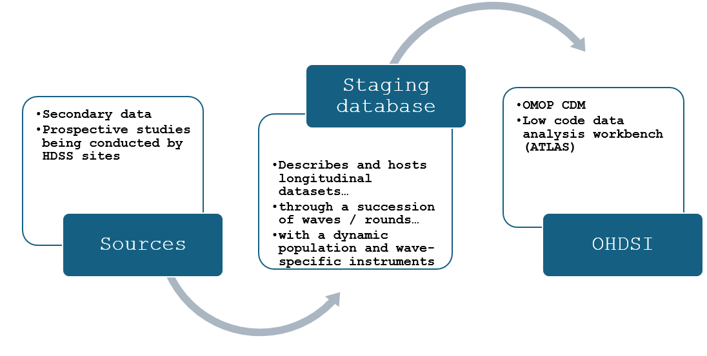

# Staging database, Metadata tables, ETL source to staging, Merging various ETL instances to central staging and Metabase
This folder contains information and code on the structure of the staging database, generated metadata tables from the various studies, ETL(extract, transform and load) source data to a local instance of the staging database, merging various local instances to central staging data base and visualizing the database on a platform.

The steps follow a chronological order as below:

## 1. Creating the Staging database

The staging database follows the **DDI Lifecycle specification**, chronicling the execution of longitudinal studies from one wave to the next across a dynamic population with in-migration and out-migration, as the case may be. Also, from one wave to the next there may be one or more mental health instruments.

This staging database is structured as a **star schema** and has two `endpoints`: 

    1. It is a window into study execution and is the basis for reporting
    2. Studies in the staging database may be ETLed into the OMOP CDM for 
    subsequent descriptive, predictive and causal analysis

The staging database structure was designed using a Relational Database Diagram Design Tool [dbdiagram](https://dbdiagram.io/). The ERD (Entity-Relationship Diagram) for the staging can be found [here](https://dbdiagram.io/d/MH-INSPIRE-Staging-Dataset-v1-1-65fa7820ae072629ce783398).
    
## 2. Generating Metadata tables

## 3. ETL from source data to staging

### Data processing
Data processing is a crucial aspect of any data related project and involves organizing, cleaning, and preparing data for analysis using appropriate tools and techniques.

It is important to clearly separate the design of the ETL from the implementation of the ETL. Designing the ETL requires extensive knowledge of both the source data, as well as the CDM. Implementing the ETL on the other hand typically relies mostly on technical expertise on how to make the ETL computationally efficient.

## 4. Merge the various ETL-source data to staging instances to central staging database

## 5. Create Visualization platform (Metabase)

