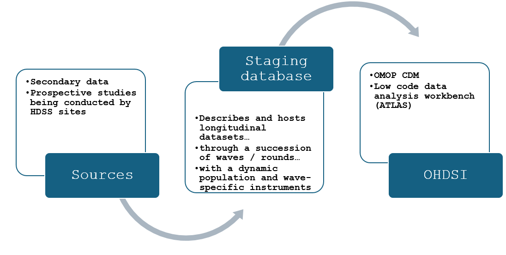

# Staging database, OMOP-CDM and ATLAS analysis

## Summary
Longitudinal studies are essential for understanding the progression of mental health disorders over time, but combining data collected through different methods to assess conditions like depression, anxiety, and psychosis presents significant challenges. This project will utilize a mapping technique allowing for the conversion of diverse longitudinal data into a standardized staging database, leveraging the [Data Documentation Initiative (DDI) Lifecycle](https://ddi-lifecycle-documentation.readthedocs.io/en/latest/User%20Guide/Introduction.html) and the [Observational Medical Outcomes Partnership (OMOP) Common Data Model (CDM)](https://ohdsi.github.io/CommonDataModel/) standards to ensure consistency and compatibility across datasets.

The “INSPIRE” project integrates longitudinal data from African studies into a staging database using **metadata documentation standards structured with a snowflake schema**. Adherence to metadata standards ensures data quality, promotes interoperability, and expands opportunities for data sharing in mental health research.  
- The staging database schema is designed to capture the dynamic nature of longitudinal studies, including changes in research protocols and the use of different instruments across data collection waves.
- Utilizing the staging database will streamline the data migration process. This facilitates the development of Extraction, Transformation, and Loading (ETL) scripts for subsequent integration into the OMOP CDM.

The staging database serves as an innovative tool in managing longitudinal mental health data, going beyond simple data hosting to act as a comprehensive study descriptor. It provides detailed insights into each study stage and establishes a data science foundation for standardizing and integrating the data into OMOP CDM.

## Source Data

### Secondary data
To ensure the diversity of tools mapped, the selection of secondary datasets from the 17 articles to be mapped to the staging database was based on the mental health assessment tools used as below:

- **Depression**: Edinburgh Postpartum Depression Scale (EPDS), Depression, anxiety and stress scale (DASS-21), Center of Epidemiologic Studies Depression Scale (CES-D 10 & CES-D 8) and Patient Health Questionnaire 9 item (PHQ-9)
- **Anxiety**: Depression, anxiety and stress scale (DASS-21) and Generalized Anxiety Disorder 7-item (GAD-7)
- **Psychosis**: Psychosis Screening Questionnaire (PSQ)  

The final studies to be mapped were from 11 articles as highlighted in the table below on the ***ETL to Staging column***.

| **number** | **study country** | **source title** | **link doi** | **tools used** | **ETL to Staging** |
|---|---|---|---|---|---|
| **1** | Kenya | Demographic, Psychosocial And Clinical Factors Associated With Postpartum Depression In Kenyan Women | https://doi.org/10.1186/s12888-018-1904-7 | Edinburgh Postnatal Depression Scale (EPDS) | Yes |
| **2** | Uganda | One Year Prevalence Of Psychotic Disorders Among First Treatment Contact Patients At The National Psychiatric Referral And Teaching Hospital In Uganda | https://doi.org/10.1371/journal.pone.0218843 | Diagnostic and Statistical Manual of Mental disorders 5th edition (DSM-5) | No |
| **3** | Uganda | Effect Of Suicidality On Clinical And Behavioural Outcomes In Hiv Positive Adults In Uganda | https://doi.org/10.1371/journal.pone.0254830 | Mini International Neuropsychiatric Interview (MINI) | No |
| **4** | Ethiopia | A Longitudinal Comparative Analysis Of Economic And Family Caregiver Burden Due To Bipolar Disorder | https://hdl.handle.net/10520/EJC72683 | WHO Composite International Diagnostic Interview (CIDI);Family caregiver burden questionnaire | No |
| **5** | Ethiopia | Longitudinal Mediation Analysis Of The Factors Associated With Trajectories Of Posttraumatic Stress Disorder Symptoms Among Postpartum Women In Northwest Ethiopia: Application Of The Karlson-Holm-Breen (Khb) Method | https://doi.org/10.1371/journal.pone.0266399 | Depression Anxiety Stress Scale (DASS-21);Traumatic Event Scale (TES);Posttraumatic Stress Disorder Checklist for DSM-5 (PCL-5);WHOQOL-BREF;WHO Disability Assessment Schedule (WHODAS 2.0);Wijma Delivery Expectation/Experience Questionnaire (W-DEQ);List of Threatening Experiences Questionnaire (LTE-Q);Oslo Social Support Scale (OSSS-3);WHO (2005) multi country study questionnaire on domestic violence | Yes |
| **6** | Ethiopia | Longitudinal Path Analysis For The Directional Association Of Depression, Anxiety And Posttraumatic Stress Disorder With Their Comorbidities And Associated Factors Among Postpartum Women In Northwest Ethiopia: A Cross-Lagged Autoregressive Modelling Study | https://doi.org/10.1371/journal.pone.0273176 | Depression Anxiety Stress Scale (DASS-21);Traumatic Event Scale (TES);Posttraumatic Stress Disorder Checklist for DSM-5 (PCL-5);Wijma Delivery Expectation/Experience Questionnaire (W-DEQ);Oslo Social Support Scale (OSSS-3) | Yes |
| **7** | South Africa | Protective Behaviors And Secondary Harms Resulting From Nonpharmaceutical Interventions During The Covid-19 Epidemic In South Africa: Multisite, Prospective Longitudinal Study | https://doi.org/10.2196/26073 | Patient Health Questionnaire (PHQ-2);Generalized Anxiety Disorder (GAD-2) | No |
| **8** | South Africa | Lifestyle Factors, Mental Health, And Incident And Persistent Intrusive Pain Among Ageing Adults In South Africa | https://doi.org/10.1515/sjpain-2022-0013 | Brief Pain Inventory (BPI);General Physical Activity Questionnaire (GPAQ);Center for Epidemiological Studies-Depression (CES-D);Posttraumatic Stress Disorder (PTSD) scale by Breslau;Brief Version of the Pittsburgh Sleep Quality Index (B-PSQI) | Yes |
| **9** | Egypt | Demographic And Clinical Characteristics Of Children Seeking Psychiatric Services In The Nile Delta Region: An Observational Retrospective Study | https://doi.org/10.1186/s13033-019-0323-6 | MINI International Neuropsychiatric Interview for Children and Adolescents (MINI-Kid);Stanford-Binet Intelligence quotient (IQ) fourth edition | No |
| **10** | South Africa | Self-Reported Sleep Duration And Its Correlates With Sociodemographics, Health Behaviours, Poor Mental Health, And Chronic Conditions In Rural Persons 40 Years And Older In South Africa | https://doi.org/10.3390/ijerph15071357 | Cut down-Annoyed-Guilty-Eye opener (CAGE);General Physical Activity Questionnaire (GPAQ);Center for Epidemiological Studies-Depression (CES-D);Posttraumatic Stress Disorder (PTSD) scale by Breslau | Yes |
| **11** | South Africa | Covid-19 Risk Perceptions And Depressive Symptoms In South Africa: Causal Evidence In A Longitudinal And Nationally Representative Sample | https://doi.org/10.1016/j.jad.2022.04.072 | Patient Health Questionnaire (PHQ-2) | No |
| **12** | South Africa | The Relationship Between Negative Household Events And Depressive Symptoms: Evidence From South African Longitudinal Data | https://doi.org/10.1016/j.jad.2017.04.031 | Center for Epidemiological Studies-Depression (CES-D) | Yes |
| **13** | South Africa | Simultaneous Social Causation And Social Drift: Longitudinal Analysis Of Depression And Poverty In South Africa | https://doi.org/10.1016/j.jad.2017.12.050 | Center for Epidemiological Studies-Depression (CES-D) | Yes |
| **14** | South Africa | A Nationwide Panel Study On Religious Involvement And Depression In South Africa: Evidence From The South African National Income Dynamics Study | https://doi.org/10.1007/s10943-017-0551-5 | Center for Epidemiological Studies-Depression (CES-D) | Yes |
| **15** | South Africa | Evidence On The Association Between Cigarette Smoking And Incident Depression From The South African National Income Dynamics Study 2008-2015: Mental Health Implications For A Resource-Limited Setting | https://doi.org/10.1093/ntr/nty163 | Center for Epidemiological Studies-Depression (CES-D) | Yes |
| **16** | South Africa | Proximity To Healthcare Clinic And Depression Risk In South Africa: Geospatial Evidence From A Nationally Representative Longitudinal Study | https://doi.org/10.1007/s00127-017-1369-x | Center for Epidemiological Studies-Depression (CES-D) | Yes |
| **17** | South Africa | Living Alone And Depression In A Developing Country Context: Longitudinal Evidence From South Africa | https://doi.org/10.1016/j.ssmph.2021.100800 | Center for Epidemiological Studies-Depression (CES-D) | Yes |

### Primary data
